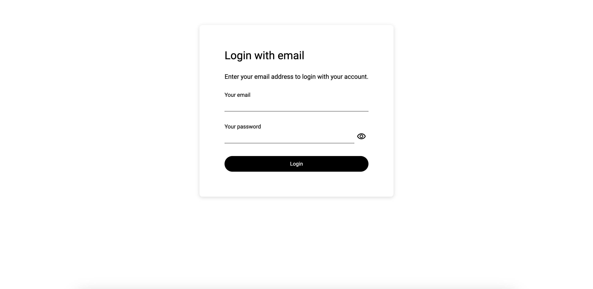

# Frontend Login Kata

Things to train:

- Refactoring
- Architecture
- Emergent Design

Welcome to ÜberTesting S.A.! We are currently facing numerous challenges with our testing suite. Our previous developer left our website in a less-than-ideal state, akin to what's humorously referred to as an "[Ice Cream Cone](https://alisterscott.github.io/TestingPyramids.html)" testing pyramid. Consequently, our tests are running slowly, leading to increased costs in our CI pipeline.

Moreover, our Login page is in disarray, with intertwined API requests, local storage mutations, and other complexities that hinder effective testing. Any attempts to modify this page result in significant time wastage.

Your task is to enhance the testing topology, code readability, and architecture of this specific page. While there are other issues present (such as the Recipes page), we will address them in subsequent sprints.

We've implemented a mocked login to simplify your testing process. You can use the account of Linus Torvalds for logging in as many times as necessary. Email: `linustorvalds@gmail.com`, Password: `ilovecats`.

Additionally, please make an effort to run the End-to-End (E2E) tests extensively. Aim to keep them consistently passing ("green"). Our objective is to ensure the code remains deployable at all times.

In summary:

- Aim to improve the architecture design of the Login page.
- Implement unit tests to prevent the formation of an "Ice Cream Cone" testing pyramid.
- Stay always in green

Have fun!
